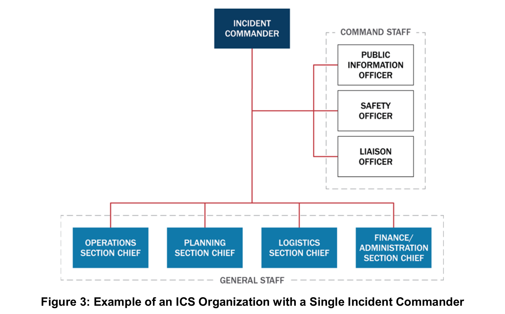
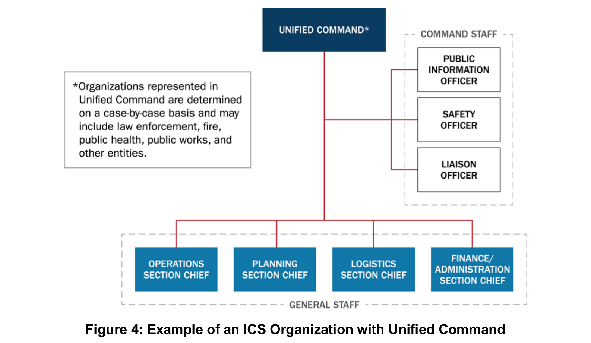
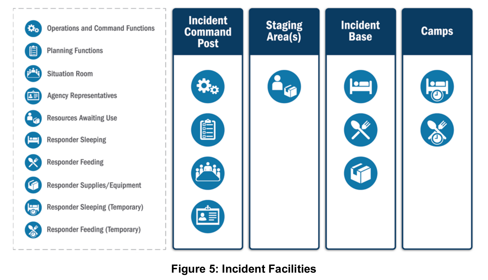
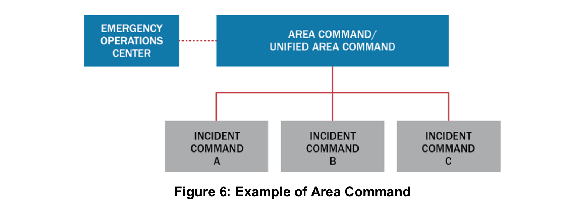
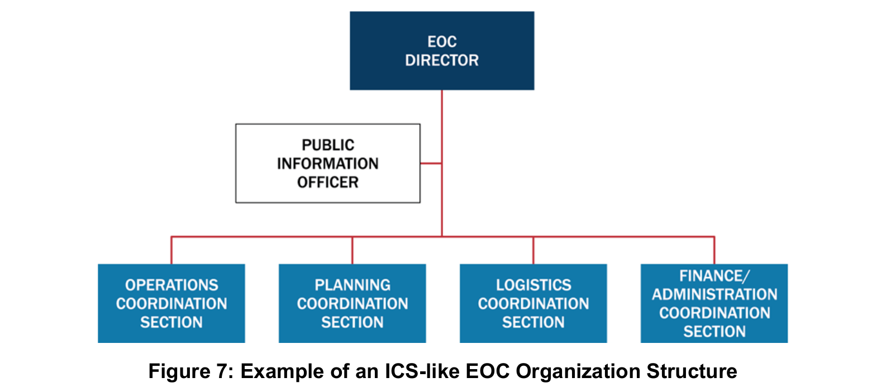
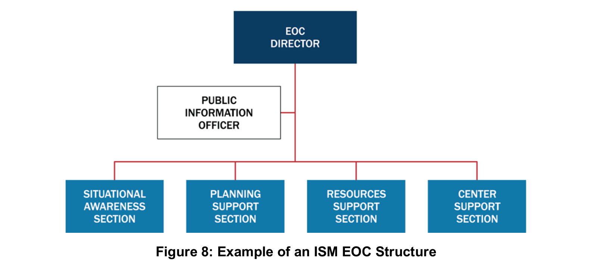
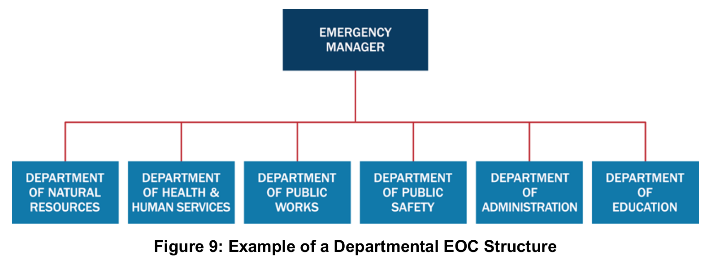
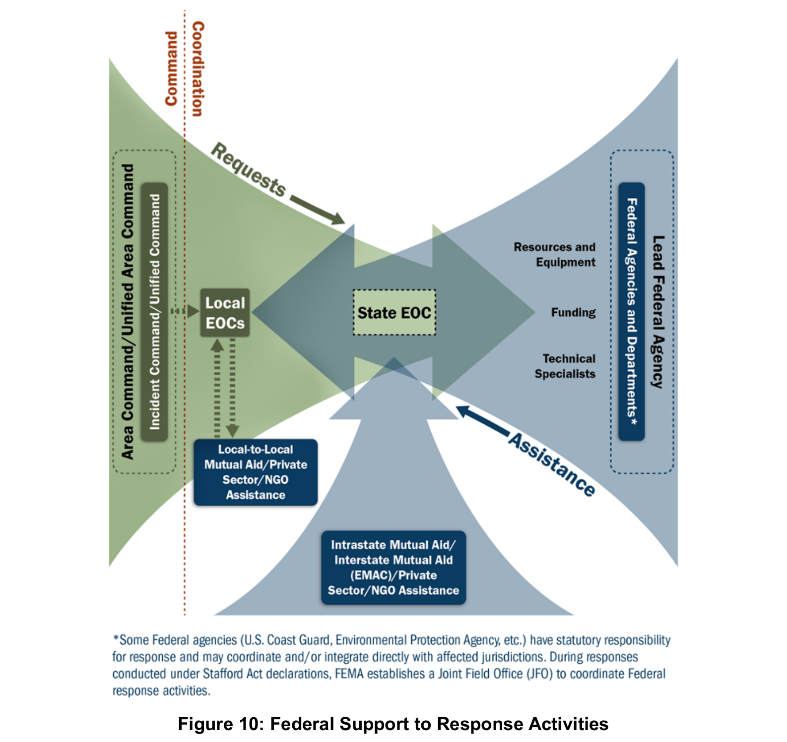

# NIMS 제3장 지휘 및 조정(Command and Coordination)

## 요약

지휘 및 조정(Command and Coordination)은 현장 전술, 대응 지원, 정책적 판단, 대국민 소통을 연결하는 체계다. 공통 용어·조직·절차로 여러 기관의 활동을 맞추면서 각 기관의 권한·책임을 유지한다. 현장지휘체계(Incident Command System, ICS), 비상운영센터(Emergency Operations Center, EOC), 다기관조정그룹(Multiagency Coordination Group, MAC Group), 합동정보시스템(Joint Information System, JIS)이 이 기능의 실행과 연계에 참여한다. (인쇄 p.19)

> [!important] 근거와 범위
> 영문 PDF를 직접 대조했다. 발췌본은 PDF 31쪽이며 인쇄 pp.19–49에 해당한다. 아래 페이지는 모두 영문 인쇄 페이지다. 번역본은 제공되지 않았으므로 번역 오류·번역본 페이지 대응은 검증하지 않았다. 미국 체계에 대한 교재 설명이며 한국 제도와의 동일성을 뜻하지 않는다.

## 자료 정보

- 발췌 제목: III. Command and Coordination.
- PDF 메타데이터 저자: FEMA. 발췌본 본문에는 표지·판권·발행연도가 없다.
- 기존 전체 교재: NIMS 전체 교재(2017년 제3판). 전체 교재 등록 정보는 2017년 10월 제3판이다. 이번 발췌본의 생성일 2026-10-08과 등록일 2026-10-09를 발행연도로 사용하지 않는다.
- PDF 페이지와 인쇄 페이지: PDF 1→인쇄19, PDF 31→인쇄49. 즉 인쇄쪽=PDF쪽+18.
- 그림: 아래 해당 설명에 원문 Figure 3–10 전체 8개를 삽입했다.
- 사용자 참고보고서: 사용자 제공 ChatGPT 학습보고서(원문 검증의 참고자료).

## 장의 구조

| 인쇄 페이지 | 내용 |
| --- | --- |
| 19 | 네 책임 영역과 다기관조정체계(Multiagency Coordination Systems, MACS) |
| 20–23 | NIMS 관리특성(NIMS Management Characteristics) |
| 24–32 | ICS, 지휘·참모, 정보·수사, 시설, 사고관리팀(IMT) |
| 33–34 | 사고관리지원팀(IMAT), 사고복합체(Incident Complex), 광역지휘부(Area Command) |
| 35–39 | EOC 기능·조직형태·가동 및 가동 해제 |
| 40–41 | MAC Group |
| 42–46 | JIS, 공보관(PIO), 합동정보센터(JIC), 대국민 정보처리 |
| 47–49 | 체계 간 연계와 연방 지원·주도 역할 |

## 네 기능과 상호연계

아래는 학습을 위한 기능 중심 정리다. 네 책임 영역과 네 구성요소가 배타적으로 일대일 대응한다는 뜻은 아니다. 원문은 MACS가 구성요소 사이에서 이 책임 영역을 조정한다고 설명한다. (p.19)

| 구성요소 | 주된 역할 | 설명의 경계 |
| --- | --- | --- |
| ICS | 현장 사건관리의 지휘·통제·조정 | ICS에도 조정 기능이 있다. ‘지휘는 ICS, 조정은 EOC’라는 완전한 이분법은 부정확하다. pp.24–25 |
| EOC | 정보 수집·분석·공유, 자원 요청·배분·추적, 계획 조정 | 일부 운영을 맡고, 현장지휘가 수립되지 않은 경우 전술작전을 지휘할 수 있다. p.35 |
| MAC Group | 정책 수준의 공동 판단, 자원 우선순위·배분 | 현장지휘 기능을 수행하거나 작전·조정·출동조직의 기본 기능을 대체하지 않는다. p.40 |
| JIS | 기관 간 메시지와 공보활동의 통합·조정 | 현장/전술·센터/조정·정책/전략의 세 수준을 가로지른다. p.42 |

다기관조정체계(MACS)는 이 네 책임 영역을 구성체계 사이에서 조정하는 체계다. MAC Group은 그 구성요소 하나이며, MACS 전체와 같은 뜻이 아니다. (p.19)

## 관리특성 14개

원문 p.20의 목록을 읽기 순서에 맞춰 정리했다. 세부 설명은 pp.20–23에 있다.

| 번호 | 관리특성 | 핵심 의미 |
| --- | --- | --- |
| 1 | 공통 용어(Common Terminology) | 조직기능·자원·시설 명칭을 표준화한다. |
| 2 | 모듈형 조직(Modular Organization) | 규모·복잡성·위험에 따라 기능을 확장하고 위임한다. 미배치 기능의 책임은 상위 감독자에게 남는다. |
| 3 | 목표관리(Management by Objectives) | 측정 가능한 목표, 전략·전술·임무, 배정, 결과 기록을 연결한다. |
| 4 | 사건행동계획(Incident Action Planning) | 목표·전술·임무를 계획으로 전달한다. 모든 사건에 행동계획이 필요하지만 모두 서면일 필요는 없다. |
| 5 | 적정 통할범위(Manageable Span of Control) | 감독 능력에 맞게 보고·감독 관계를 구성한다. |
| 6 | 사건시설과 위치(Incident Facilities and Locations) | 상황에 따라 지휘·지원 시설을 정하고 위치를 식별한다. |
| 7 | 종합 자원관리(Comprehensive Resource Management) | 인력·장비·팀·물자·시설의 최신 현황을 관리한다. |
| 8 | 통합 통신(Integrated Communications) | 공통 통신계획과 상호운용 가능한 음성·데이터 연결을 마련한다. |
| 9 | 지휘 수립과 이양(Establishment and Transfer of Command) | 지휘를 초기에 정하고, 이양 시 핵심상황 브리핑과 관련 인원 통지를 수행한다. |
| 10 | 통합지휘(Unified Command) | 공동 승인 목표로 사건을 관리하며 참여 기관의 권한·책임을 유지한다. |
| 11 | 지휘계통과 지휘 일원성(Chain of Command and Unity of Command) | 권한의 계통을 명확히 하고 개인은 한 명에게 보고한다. |
| 12 | 책임성(Accountability) | 출입 확인·계획·개인 책임·통할범위·자원 추적으로 책임을 확보한다. |
| 13 | 출동·배치(Dispatch/Deployment) | 적절한 권한자의 요청과 정식 출동 절차를 따른다. 요청 없는 자발적 배치는 삼간다. |
| 14 | 정보 및 첩보 관리(Information and Intelligence Management) | 사건 관련 정보·첩보를 수집·분석·평가·공유·관리한다. |

### 오해하기 쉬운 조건

- **1:5는 권장 기준이다.** 최적 통할범위를 감독자 1명당 부하 5명으로 제시하지만, 실제 대응에서는 상당히 다른 비율도 필요하다. 사건·임무·위험·안전·경험·통신 접근성을 고려해 판단한다. (pp.21–22)
- **서면 IAP의 필요성은 조건부다.** 복잡성, 지휘 판단, 법적 요구에 따른다. 예고 없는 사건의 첫 작전기간에는 정식 IAP가 없을 수 있다. 작전기간이 길어지거나 복잡해지고 여러 관할·기관이 참여하면 서면 IAP의 중요성이 커진다. (p.21)
- **통합지휘와 지휘 일원성은 양립한다.** 기관 수준에서는 공동 목표·전략·단일 IAP를 정하며, 개인 수준에서는 한 명에게 보고한다. 각 기관의 인력·자원에 대한 권한·책임·책임성은 유지된다. (pp.22–26)
- **첩보의 의미는 제한된다.** 각주13은 법집행·의학적 감시·수사조직이 생산하는 위협 관련 정보를 뜻한다고 명시한다. 모든 일반 상황정보와 동일시하지 않는다. (p.23)

## ICS 조직과 시설

### 다섯 주요 기능과 참모

ICS의 다섯 주요 기능은 지휘(Command), 작전(Operations), 계획(Planning), 지원(Logistics), 재무·행정(Finance/Administration)이다. 필요한 기능만 담당자를 배치하며, 부서장이 배치되기 전에는 지휘관 또는 통합지휘부가 해당 기능을 책임진다. (pp.24, 28)

- **지휘참모(Command Staff):** 공보관(Public Information Officer, PIO), 안전담당관(Safety Officer), 연락관(Liaison Officer)이 일반적이다. 지휘관/통합지휘부에 직접 보고한다. 추가 자문가는 자문 역할이며 활동 지휘권을 가진 담당관과 구분된다. (pp.27–28)
- **일반참모(General Staff):** 작전·계획·지원·재무행정 부서장이다. 작전은 전술 수행, 계획은 상황·자원현황과 IAP 작성, 지원은 시설·보급·통신·대응인력 의료지원, 재무행정은 시간·계약·청구·비용을 담당한다. (pp.28–30)
- **안전 책임:** 안전담당관은 불안전한 행위를 중단·예방한다. 안전에 대한 궁극적 책임은 지휘관/통합지휘부와 각급 감독자에게 있다. (p.27)
- **정보·수사 기능(Intelligence/Investigations Function):** 범죄·테러뿐 아니라 역학조사 등에도 필요할 수 있다. 배치 위치와 범위는 지휘부가 결정하며 상세 선택지는 이 발췌본 밖 Appendix A에 있다. (pp.30–31)

### 그림 3. 단일 사고지휘관의 ICS 조직

*원문 Figure 3, 인쇄 p.25 / PDF p.7. 원문 도식을 그대로 추출했으며 한국어 제목은 학습용 설명이다.*

### 그림 4. 통합지휘부의 ICS 조직

*원문 Figure 4, 인쇄 p.26 / PDF p.8. 원문 도식을 그대로 추출했으며 한국어 제목은 학습용 설명이다.*

### 시설과 사고관리팀

| 명칭 | 역할 | 인쇄 페이지 |
| --- | --- | --- |
| 현장지휘소(Incident Command Post, ICP) | 현장 전술 수준 지휘·계획의 거점 | 31 |
| 대기구역(Staging Area) | 임무 배정을 기다리는 자원을 배치·추적. 작전부서가 관리한다. | 31 |
| 사건기지(Incident Base) | 주요 지원활동의 거점. ICP와 같은 위치일 수 있다. | 31 |
| 캠프(Camp) | 사건기지의 위성 지원거점. 식사·숙박·위생 등을 제공한다. | 32 |
| 사고관리팀(Incident Management Team, IMT) | ICS 자격 인력의 편성팀. 사건관리 또는 지원 임무를 맡는다. | 32 |
| 사고관리지원팀(Incident Management Assistance Team, IMAT) | 현장·피해 관할 지원을 강조하는 팀. 일부 자원·대응 활동의 지휘통제 권한도 가질 수 있다. | 33 |

### 그림 5. 사건 시설별 기능

*원문 Figure 5, 인쇄 p.32 / PDF p.14. 원문 도식을 그대로 추출했으며 한국어 제목은 학습용 설명이다.*

## 여러 사고의 관리

- **사고복합체(Incident Complex):** 같은 일반 지역의 두 개 이상 사고를 한 지휘관/통합지휘부와 하나의 ICS 조직 아래 둔다. 개별 사고는 작전부서의 Branch 또는 Division이 된다. 대형화될 사고는 별도 ICS로 관리해야 한다. (p.33)
- **광역지휘부(Area Command):** 여러 동시 사고 또는 여러 ICS가 필요한 매우 복잡한 사고의 관리를 감독한다. 자원 경쟁·우선순위·사고 목표의 충돌을 조정한다. 개별 ICS 지휘부를 하나로 합치는 개념은 아니다. (pp.33–34)
- **Figure 6의 관계:** Area Command는 복수 사고관리를 감독하고, EOC는 지원을 조정하며, MAC Group은 Area Command와 EOC에 정책 지침·전략 방향을 제공한다. (p.34)

### 그림 6. 광역지휘부와 복수 사고지휘부

*원문 Figure 6, 인쇄 p.34 / PDF p.16. 원문 도식을 그대로 추출했으며 한국어 제목은 학습용 설명이다.*

## EOC 조직과 가동

EOC는 고정 시설·임시 시설·가상 구조로 운영할 수 있다. 부서운영센터(Departmental Operations Center, DOC)는 주로 자기 기관의 자원·작전을 관리한다. NIMS가 다루는 EOC는 본질적으로 여러 분야의 협력 활동이다. (p.35)

세 가지 조직형태는 예시이며 임무·권한·인력·참여기관·시설·통신 등을 고려해 선택한다. 모두 NIMS 관리특성을 따른다. (pp.36–38)

1. **ICS형 또는 유사형(ICS or ICS-like):** 현장 조직과 대응되는 구조를 쓰되 지원·조정 성격에 맞게 직책명을 조정할 수 있다.
2. **사건지원모형(Incident Support Model, ISM):** 상황인식을 계획에서 분리하고 작전·지원 기능을 사건지원 구조로 결합한다. 자원 확보·주문·추적을 간소화한다.
3. **부서형(Departmental):** 평시 부서·기관 관계를 활용한다. 비상관리 담당자 또는 고위 책임자가 기관 간 활동을 조정한다.

### 그림 7. ICS 유사형 EOC 조직

*원문 Figure 7, 인쇄 p.37 / PDF p.19. 원문 도식을 그대로 추출했으며 한국어 제목은 학습용 설명이다.*

### 그림 8. 사건지원모형(ISM) EOC 조직

*원문 Figure 8, 인쇄 p.37 / PDF p.19. 원문 도식을 그대로 추출했으며 한국어 제목은 학습용 설명이다.*

### 그림 9. 부서형 EOC 조직

*원문 Figure 9, 인쇄 p.38 / PDF p.20. 원문 도식을 그대로 추출했으며 한국어 제목은 학습용 설명이다.*

### 가동 수준 — Table 2, p.39

| 수준 | 원문 명칭 | 내용 |
| --- | --- | --- |
| 3 | Normal Operations/Steady State | 정상 운영, 평시 감시·경보 |
| 2 | Enhanced Steady-State/Partial Activation | 일부 구성원이 신뢰할 만한 위협을 감시하거나 발전 가능성이 있는 사건을 지원 |
| 1 | Full Activation | 주요 사건·신뢰할 만한 위협에 대응하도록 지원기관 인력을 포함한 EOC팀 가동 |

외부 소통에는 표준 가동 명칭을 사용한다. 내부에서는 숫자·색상도 쓸 수 있으며, 숫자를 쓰면 작아질수록 높은 가동 수준이 되도록 한다. 각 수준은 대면·원격 참여가 가능하다. 가동 해제(Deactivation)는 지원·조정 수요가 줄거나 다른 체계로 수행 가능할 때 단계적으로 할 수 있으며, 자원 동원해제·잔여 활동 이관·사후 검토 계획을 포함한다. (pp.38–39)

## MAC Group의 정책 판단

관할의 법·정책에 따라 MAC Group이 추가 자원을 승인하거나 EOC·현장지휘부에 지침을 제공할 수 있다. 현장지휘 기능을 대신한다는 뜻은 아니다. (p.40)

MAC Group은 기관 관리자·고위 책임자·그 대리인 등으로 구성하고 대체로 합의에 기초해 판단한다. 대리인은 자기 조직을 대표하거나 사건활동에 자원·예산을 투입할 권한을 받아야 한다. 자금·물자가 없어도 관계·정치적 영향력·전문성을 가진 기관이 참여할 수 있다. 가상 방식으로 운영할 수 있으며 EOC 인력이 지원하거나 일부 활동을 수행할 수도 있다. (pp.40–41)

## JIS와 JIC

JIS는 공보의 과정·절차·도구를 연결하는 체계이며, 합동정보센터(Joint Information Center, JIC)는 그 활동을 수행하는 거점이다. JIC는 독립 거점·사건현장·EOC 구성요소로 설치할 수 있다. 원칙적으로 단일 JIC를 두지만 넓은 지역·복합 사건에서는 복수의 물리적 또는 가상 JIC를 둘 수 있으며 메시지와 최종 공개 권한을 조정해야 한다. (pp.42–44)

### JIC 유형 — Table 3, p.44

| 유형 | 기능 |
| --- | --- |
| 사건형(Incident JIC) | 현장 관련 PIO의 공동 근무 거점. EOC에 둘 수 있다. |
| 가상형(Virtual JIC) | 물리적 공동 근무가 어려울 때 기술·통신 규약으로 연결한다. |
| 위성형(Satellite JIC) | 주 JIC를 지원하며 그 통제 아래 운영한다. |
| 광역형(Area JIC) | 넓은 지역의 복수 사건 ICS를 지원한다. |
| 국가형(National JIC) | 통상 장기 사건에서 연방 사건관리를 지원한다. |

정보처리는 **수집(Gathering)→검증(Verifying)→조정(Coordinating)→전파(Disseminating)**의 지속적 순환이다. 공통 메시지와 권한자의 승인을 조정하고, 승인 절차는 적시에 공개할 수 있도록 간소화한다. 영어 능력·장애·접근 및 기능상 필요를 고려한 다양한 형식을 제공한다. 기관별 정책·프로그램 정보 통제권은 유지한다. 소문·부정확한 정보·정보 공백도 모니터링한다. (pp.43–46)

## 지방·주·연방 체계의 연계

지역에서 확보할 수 없는 자원은 상호원조와 주·부족·영토·주간 지원으로 확대한다. 연방 개입은 주지사·부족 지도자의 요청 승인, 연방 이해관계, 법률상 권한·의무 등의 조건에 따른다. 연방은 지원 역할을 수행할 수 있고, 연방 소유지·주된 연방 관할 등에서는 주도할 수도 있다. Figure 10은 **주로 지원 역할을 하는 경우**의 통합을 보여주며 모든 사건의 고정 지휘구조가 아니다. (pp.47–49)

### 그림 10. 연방정부가 주로 지원 역할을 하는 대응 연계

*원문 Figure 10, 인쇄 p.48 / PDF p.30. 원문 도식을 그대로 추출했으며 한국어 제목은 학습용 설명이다.*

## 그림·표 찾아보기

| 번호 | 인쇄쪽 / PDF쪽 | 학습 초점 |
| --- | --- | --- |
| Figure 3 | 25 / 7 | 단일 사고지휘관의 ICS 예시 |
| Figure 4 | 26 / 8 | 통합지휘부의 ICS 예시 |
| Figure 5 | 32 / 14 | 사건 시설 |
| Figure 6 | 34 / 16 | Area Command·EOC·MAC Group 관계 |
| Figure 7 | 37 / 19 | ICS 유사형 EOC |
| Figure 8 | 37 / 19 | ISM형 EOC |
| Figure 9 | 38 / 20 | 부서형 EOC |
| Figure 10 | 48 / 30 | 연방정부가 주로 지원 역할을 하는 연계 |
| Table 2 | 39 / 21 | EOC 가동 수준 |
| Table 3 | 44 / 26 | JIC 유형 |

## 근거와 후속 작업

- NotebookLM JSON의 `references`는 빈 목록이다. 답변에 표시된 페이지를 근거 payload로 간주하지 않았으며, 직접 원문과 별도 검토로 대조했다. 서면 IAP 의무 강화, p.19 대국민 소통을 p.20으로 표기한 오류, DOC에 대한 “자사” 표현을 교정했다.
- NotebookLM 분석은 동일 원문의 반복 질의이므로 독립 증거로 세지 않았다.
- 독립 읽기 전용 검토 후 주장·조건·쪽수를 대조하고 교정했다.
- 발표용 학습 흐름과 번역 검토 보류 목록: [발표 학습 가이드](study-guide.md).
- 관련 전체 교재: NIMS 전체 교재(2017년 제3판).
